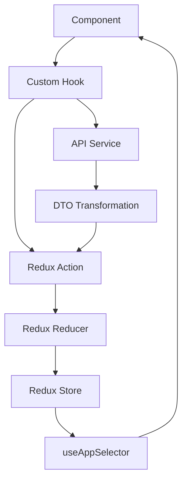

# 🏗️ Arquitetura Geral

## 📋 Visão Geral

Esta aplicação Pokémon é construída com **Preact**, **Redux Toolkit**, **Material-UI** e segue uma **arquitetura baseada em features**. O projeto foi estruturado para escalabilidade, manutenibilidade e testabilidade.

## 🛠️ Stack Tecnológica

### Core

- **Preact**: Framework JavaScript leve e rápido
- **Redux Toolkit**: Gerenciamento de estado global
- **Material-UI (MUI)**: Biblioteca de componentes UI
- **SCSS/Sass**: Pré-processador CSS
- **Preact Router**: Roteamento da aplicação

### Desenvolvimento

- **Vite**: Build tool e dev server
- **Vitest**: Framework de testes
- **Testing Library**: Utilitários para testes de componentes
- **ESLint**: Linter de código JavaScript

### API

- **PokéAPI REST**: API oficial dos Pokémon (REST)
- **PokéAPI GraphQL**: API GraphQL para consultas avançadas

## 📁 Estrutura do Projeto (Feature-Based Architecture)

```
src/
├── components/           # Componentes globais reutilizáveis
│   ├── layout/          # Componentes de layout (Header, Sidebar, MainLayout)
│   └── ProtectedRoute.jsx
├── features/            # 🏗️ ARQUITETURA BASEADA EM FEATURES
│   ├── auth/           # 🔐 Feature de Autenticação
│   │   ├── components/
│   │   │   ├── containers/      # LoginFormContainer
│   │   │   ├── presentations/   # LoginFormPresentation
│   │   │   └── index.js
│   │   ├── dto/                 # DTOs específicos de auth
│   │   │   ├── api/            # ApiErrorDTO, LoginResponseDTO
│   │   │   ├── redux/          # AuthStateDTO, UserDTO
│   │   │   ├── validation/     # AuthValidationDTO
│   │   │   └── index.js
│   │   ├── hooks/              # useAuth
│   │   ├── store/              # authSlice
│   │   ├── styles/             # login-form.scss
│   │   └── index.js            # Exports da feature
│   │
│   ├── pokemon/        # 🎮 Feature Principal dos Pokémon
│   │   ├── components/
│   │   │   ├── containers/      # PokemonCardContainer
│   │   │   ├── presentations/   # PokemonCardPresentation
│   │   │   └── index.js
│   │   ├── dto/                 # DTOs específicos de pokemon
│   │   │   ├── api/            # PokemonDTO, PokemonListResponseDTO
│   │   │   ├── redux/          # PokemonStateDTO, PokemonFiltersDTO
│   │   │   ├── validation/     # PokemonValidationDTO
│   │   │   └── index.js
│   │   ├── hooks/              # usePokemon, useFavorites, useComparison
│   │   ├── pages/              # HomePage, PokemonListPage, PokemonDetailsPage
│   │   ├── services/           # pokemonApi.js, pokemonGraphQLApi.js
│   │   ├── store/              # pokemonSlice, favoritesSlice, comparisonSlice
│   │   ├── styles/             # pokemon-card.scss, pokemon-filters.scss
│   │   └── index.js
│   │
│   ├── i18n/           # 🌍 Feature de Internacionalização
│   │   ├── hooks/              # useTranslation
│   │   ├── locales/            # en-US.json, pt-BR.json
│   │   └── index.js
│   │
│   └── shared/         # 🔧 Recursos Compartilhados
│       ├── components/         # Componentes reutilizáveis
│       ├── dto/                # DTOs globais
│       │   ├── redux/          # UIStateDTO, NotificationDTO
│       │   ├── validation/     # FormValidationDTO, UIValidationDTO
│       │   ├── factory/        # DTOFactory, DTOUtils, DTO_TYPES
│       │   └── index.js
│       ├── hooks/              # useAppDispatch, useAppSelector
│       ├── store/              # uiSlice
│       ├── styles/             # variables.scss, mixins.scss, base.scss
│       ├── utils/              # serviceWorker.js
│       └── index.js
│
├── store/               # ⚙️ Configuração principal do Redux
│   └── index.js        # Store configurado
├── test/                # Configuração de testes
│   └── setup.js
├── theme/               # Configuração de tema MUI
│   └── theme.js
└── index.js            # 🎯 Barrel exports principal
```

## 🎯 Princípios Arquiteturais

### 1. **Arquitetura Baseada em Features**

- Código organizado por funcionalidades de negócio
- Cada feature é autocontida com seus próprios componentes, hooks, DTOs, services e lógica
- Barrel exports para APIs limpas entre features
- Facilita escalabilidade e trabalho em equipe

### 2. **Container/Presentation Pattern**

- **Containers**: Lógica de negócio, estado, side effects
- **Presentations**: UI pura, altamente reutilizável
- Separação clara entre lógica e apresentação
- Facilita testes e reutilização

### 3. **Hook Pattern**

- Hooks especializados por feature
- Encapsulamento de lógica de estado e regras de negócio
- Reutilização consistente entre componentes
- Interface limpa para componentes

### 4. **Separação de Responsabilidades**

- **Components**: Containers (lógica) + Presentations (UI)
- **Hooks**: Lógica de negócio e estado por feature
- **Services**: Comunicação com APIs por feature
- **Store**: Gerenciamento de estado por feature + global
- **DTOs**: Contratos de dados organizados por responsabilidade

### 5. **Camadas da Aplicação**

```
┌─────────────────────────────────────┐
│              UI Layer               │ ← Components, Pages
├─────────────────────────────────────┤
│           Business Layer            │ ← Hooks, Features Logic
├─────────────────────────────────────┤
│            Service Layer            │ ← API Services, DTOs
├─────────────────────────────────────┤
│             Data Layer              │ ← Redux Store, State
└─────────────────────────────────────┘
```

### 6. **Padrões de Dados**

- **DTOs** para transformação entre camadas
- **Redux Toolkit** para estado global
- **Custom Hooks** para encapsular lógica

## 🔄 Fluxo de Dados



## 🎨 Padrões de UI

### Material-UI Integration

- Uso consistente do sistema de design do MUI
- Tema customizado com cores e tipografia
- Componentes responsivos out-of-the-box

### SCSS Organization

- Variáveis centralizadas para cores, spacing, breakpoints
- Mixins para padrões reutilizáveis
- Organização modular por funcionalidade

## 🔐 Autenticação

### Padrão de Autenticação

- Estado gerenciado no Redux (`authSlice`)
- Hook `useAuth` para encapsular lógica
- `ProtectedRoute` component para proteção de rotas
- Simulação de login para demonstração

## 📊 Gerenciamento de Estado

### Redux Toolkit

- **authSlice**: Estado de autenticação
- **pokemonSlice**: Lista, filtros, paginação e detalhes dos Pokémon
- **favoritesSlice**: Sistema completo de favoritos com busca e ordenação
- **comparisonSlice**: Comparação entre Pokémon (até 4 simultâneos)
- **uiSlice**: Estado da interface (sidebar, tema, loading)

### Custom Hooks

- Abstração da complexidade do Redux
- Lógica de negócio encapsulada
- API simples para componentes

## 🧪 Estratégia de Testes

### Tipos de Testes

- **Unit Tests**: Hooks, services, utilities
- **Component Tests**: Rendering, interaction, props
- **Integration Tests**: Feature flows

### Ferramentas

- **Vitest**: Test runner
- **Testing Library**: Component testing
- **MSW/Mocks**: API mocking

## 🚀 Performance

### Otimizações Implementadas

- Preact (menor que React)
- Code splitting por features
- Lazy loading de componentes
- Memoização adequada

### Futuras Otimizações

- Service Workers
- Caching estratégico
- Bundle analysis
- Image optimization

## 📱 Responsividade

### Abordagem Mobile-First

- Breakpoints do Material-UI
- Grid system responsivo
- Componentes adaptativos

## 🎯 Próximos Passos

1. **PWA**: Service Workers e manifest
2. **Offline Support**: Cache e sincronização
3. **Performance**: Lazy loading, code splitting
4. **Accessibility**: ARIA, keyboard navigation
5. **E2E Tests**: Cypress ou Playwright
