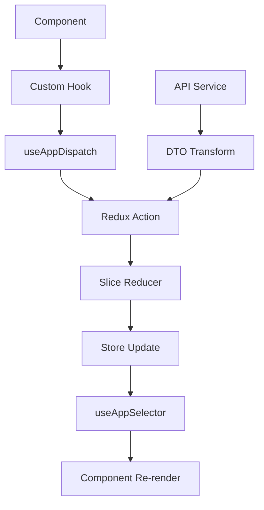

# 🔄 Gerenciamento de Estado

## 📋 Visão Geral

Esta aplicação utiliza **Redux Toolkit** para gerenciamento de estado global combinado com **Custom Hooks** para encapsular a lógica de negócio. Este documento detalha os padrões e práticas implementadas.

## 🏗️ Arquitetura de Estado

### 1. **Estrutura do Store**

```
src/
├── store/
│   └── index.js                    # Configuração principal do store
└── features/                       # Redux slices organizados por features
    ├── auth/store/
    │   └── authSlice.js           # Estado de autenticação
    ├── pokemon/store/
    │   ├── pokemonSlice.js        # Estado dos Pokémon
    │   ├── favoritesSlice.js      # Estado dos favoritos
    │   └── comparisonSlice.js     # Estado de comparação
    └── shared/store/
        └── uiSlice.js             # Estado da interface
```

### 2. **Configuração do Store**

```javascript
// src/store/index.js
import { configureStore } from "@reduxjs/toolkit";

// Importações das features
import { authSlice } from "../features/auth/store/authSlice.js";
import { pokemonSlice } from "../features/pokemon/store/pokemonSlice.js";
import { favoritesSlice } from "../features/pokemon/store/favoritesSlice.js";
import { comparisonSlice } from "../features/pokemon/store/comparisonSlice.js";

// Importações compartilhadas
import { uiSlice } from "../features/shared/store/uiSlice.js";

export const store = configureStore({
  reducer: {
    auth: authSlice.reducer,
    pokemon: pokemonSlice.reducer,
    ui: uiSlice.reducer,
    favorites: favoritesSlice.reducer,
    comparison: comparisonSlice.reducer,
  },
  middleware: (getDefaultMiddleware) =>
    getDefaultMiddleware({
      serializableCheck: {
        ignoredActions: ["persist/PERSIST"],
      },
    }),
});
```

## 🎯 Padrões de Slices

### 1. **AuthSlice - Autenticação**

```javascript
// src/store/slices/authSlice.js
import { createSlice } from "@reduxjs/toolkit";

const initialState = {
  user: null,
  isAuthenticated: false,
  isLoading: false,
  error: null,
};

export const authSlice = createSlice({
  name: "auth",
  initialState,
  reducers: {
    // ✅ Padrão: Actions síncronas para estados de loading
    loginStart: (state) => {
      state.isLoading = true;
      state.error = null;
    },
    loginSuccess: (state, action) => {
      state.isLoading = false;
      state.isAuthenticated = true;
      state.user = action.payload;
      state.error = null;
    },
    loginFailure: (state, action) => {
      state.isLoading = false;
      state.isAuthenticated = false;
      state.user = null;
      state.error = action.payload;
    },
    logout: (state) => {
      state.isAuthenticated = false;
      state.user = null;
      state.error = null;
      state.isLoading = false;
    },
    clearError: (state) => {
      state.error = null;
    },
  },
});

export const { loginStart, loginSuccess, loginFailure, logout, clearError } =
  authSlice.actions;
```

### 2. **PokemonSlice - Estado Principal**

```javascript
// src/store/slices/pokemonSlice.js
import { createSlice } from "@reduxjs/toolkit";

const initialState = {
  list: [],
  selected: null,
  filters: {
    search: "",
    type: "",
    sortBy: "name",
    sortOrder: "asc",
  },
  isLoading: false,
  error: null,
  pagination: {
    currentPage: 1,
    totalPages: 1,
    hasNext: false,
    hasPrevious: false,
  },
};

export const pokemonSlice = createSlice({
  name: "pokemon",
  initialState,
  reducers: {
    // ✅ Padrão: Ações específicas e atômicas
    setPokemonList: (state, action) => {
      state.list = action.payload;
    },
    setSelectedPokemon: (state, action) => {
      state.selected = action.payload;
    },
    // ✅ Padrão: Merge parcial para filtros
    setFilters: (state, action) => {
      state.filters = { ...state.filters, ...action.payload };
    },
    clearFilters: (state) => {
      state.filters = initialState.filters;
    },
    setLoading: (state, action) => {
      state.isLoading = action.payload;
    },
    setError: (state, action) => {
      state.error = action.payload;
    },
    setPagination: (state, action) => {
      state.pagination = action.payload;
    },
    // ✅ Padrão: Update específico para operações complexas
    updatePokemonInList: (state, action) => {
      const index = state.list.findIndex((p) => p.name === action.payload.name);
      if (index !== -1) {
        state.list[index] = {
          ...state.list[index],
          ...action.payload.updates,
        };
      }
    },
  },
});

export const {
  setPokemonList,
  setSelectedPokemon,
  setFilters,
  clearFilters,
  setLoading,
  setError,
  setPagination,
  updatePokemonInList,
} = pokemonSlice.actions;
```

### 3. **UISlice - Interface**

```javascript
// src/store/slices/uiSlice.js
import { createSlice } from "@reduxjs/toolkit";

const initialState = {
  sidebarOpen: false,
  theme: "light",
  loading: false,
};

export const uiSlice = createSlice({
  name: "ui",
  initialState,
  reducers: {
    toggleSidebar: (state) => {
      state.sidebarOpen = !state.sidebarOpen;
    },
    setSidebarOpen: (state, action) => {
      state.sidebarOpen = action.payload;
    },
    setTheme: (state, action) => {
      state.theme = action.payload;
    },
    toggleTheme: (state) => {
      state.theme = state.theme === "light" ? "dark" : "light";
    },
    setGlobalLoading: (state, action) => {
      state.loading = action.payload;
    },
  },
});

export const {
  toggleSidebar,
  setSidebarOpen,
  setTheme,
  toggleTheme,
  setGlobalLoading,
} = uiSlice.actions;
```

## 🎪 Custom Hooks para Encapsulamento

### 1. **useAuth - Autenticação**

```javascript
// src/features/auth/hooks/useAuth.js
import { useCallback } from "preact/hooks";
import {
  useAppDispatch,
  useAppSelector,
} from "../../shared/hooks/useAppDispatch.js";
import {
  loginStart,
  loginSuccess,
  loginFailure,
  logout,
} from "../store/authSlice.js";

export const useAuth = () => {
  const dispatch = useAppDispatch();
  const { user, isAuthenticated, isLoading, error } = useAppSelector(
    (state) => state.auth,
  );

  // ✅ Padrão: useCallback para funções que podem ser dependencies
  const login = useCallback(
    async (email, password) => {
      dispatch(loginStart());

      try {
        // Simulação de API call
        await new Promise((resolve) => setTimeout(resolve, 1000));

        if (email === "admin@pokemon.com" && password === "admin123") {
          const user = {
            id: "1",
            email,
            name: "Administrator",
          };
          dispatch(loginSuccess(user));
          return { success: true };
        } else {
          dispatch(loginFailure("Credenciais inválidas"));
          return { success: false, error: "Credenciais inválidas" };
        }
      } catch (error) {
        const errorMessage =
          error instanceof Error ? error.message : "Erro no login";
        dispatch(loginFailure(errorMessage));
        return { success: false, error: errorMessage };
      }
    },
    [dispatch],
  );

  const handleLogout = useCallback(() => {
    dispatch(logout());
  }, [dispatch]);

  // ✅ Padrão: Interface limpa para componentes
  return {
    user,
    isAuthenticated,
    isLoading,
    error,
    login,
    logout: handleLogout,
  };
};
```

### 2. **usePokemon - Estado Principal**

```javascript
// src/features/pokemon/hooks/usePokemon.js
import { useCallback, useEffect } from "preact/hooks";
import {
  useAppDispatch,
  useAppSelector,
} from "../../shared/hooks/useAppDispatch.js";
import {
  setPokemonList,
  setSelectedPokemon,
  setFilters,
  setLoading,
  setError,
  setPagination,
} from "../store/pokemonSlice.js";
import { PokemonApiService } from "../services/pokemonApi.js";

export const usePokemon = () => {
  const dispatch = useAppDispatch();
  const { list, selected, filters, isLoading, error, pagination } =
    useAppSelector((state) => state.pokemon);

  // ✅ Padrão: Funções async bem estruturadas
  const fetchPokemonList = useCallback(
    async (page = 1, limit = 20) => {
      dispatch(setLoading(true));
      dispatch(setError(null));

      try {
        const offset = (page - 1) * limit;
        const response = await PokemonApiService.getPokemonList(offset, limit);

        // ✅ Padrão: Transformação com DTOs
        const internalData = response.toInternal();

        dispatch(setPokemonList(internalData.results));
        dispatch(
          setPagination({
            currentPage: page,
            totalPages: Math.ceil(internalData.count / limit),
            hasNext: !!internalData.next,
            hasPrevious: !!internalData.previous,
          }),
        );
      } catch (error) {
        let errorMessage = "Erro ao carregar Pokémon";

        if (error instanceof ApiErrorDTO) {
          errorMessage = error.message;
        } else if (error instanceof Error) {
          errorMessage = error.message;
        }

        dispatch(setError(errorMessage));
      } finally {
        dispatch(setLoading(false));
      }
    },
    [dispatch],
  );

  const updateFilters = useCallback(
    (newFilters) => {
      dispatch(setFilters(newFilters));
      // ✅ Padrão: Recarregar dados quando filtros mudam
      fetchPokemonList(1); // Reset para primeira página
    },
    [dispatch, fetchPokemonList],
  );

  // ✅ Padrão: Efeito para carregar dados iniciais
  useEffect(() => {
    fetchPokemonList();
  }, [fetchPokemonList]);

  return {
    pokemonList: list,
    selectedPokemon: selected,
    filters,
    isLoading,
    error,
    pagination,
    fetchPokemonList,
    updateFilters,
    clearSelectedPokemon: useCallback(() => {
      dispatch(setSelectedPokemon(null));
    }, [dispatch]),
  };
};
```

## 🛠️ Padrões de Integração

### 1. **Hooks Utilitários**

```javascript
// src/features/shared/hooks/useAppDispatch.js
import { useDispatch, useSelector } from "react-redux";

export const useAppDispatch = () => useDispatch();
export const useAppSelector = useSelector;
```

### 2. **Uso em Componentes**

```jsx
// ✅ Padrão: Hooks no topo, lógica encapsulada
export const PokemonListPage = () => {
  const { pokemonList, filters, isLoading, error, updateFilters } =
    usePokemon();

  const handleFiltersChange = (newFilters) => {
    updateFilters(newFilters);
  };

  if (isLoading) return <CircularProgress />;
  if (error) return <Alert severity="error">{error}</Alert>;

  return (
    <MainLayout>
      <PokemonFilters filters={filters} onFiltersChange={handleFiltersChange} />
      <PokemonList pokemonList={pokemonList} />
    </MainLayout>
  );
};
```

## 📊 Estado vs Props

### ✅ Quando usar Estado Global (Redux)

- Dados compartilhados entre múltiplos componentes
- Estado que persiste entre navegação
- Cache de dados da API
- Configurações globais (tema, autenticação)

### ✅ Quando usar Estado Local (useState)

- Estado específico do componente
- Estados temporários (formulários, modais)
- Dados que não são compartilhados
- Performance crítica

### ✅ Quando usar Props

- Comunicação parent-child
- Configuração de componentes
- Callbacks e event handlers
- Dados já disponíveis no parent

## 🔄 Fluxo de Dados



## ✅ Boas Práticas Implementadas

### 1. **Estrutura de Estado**

- Estados normalizados quando possível
- Separação clara entre loading, data e error
- Initial states bem definidos

### 2. **Actions**

- Nomes descritivos e consistentes
- Payloads tipados e validados
- Ações atômicas e específicas

### 3. **Selectors**

- Encapsulados em custom hooks
- Memoização quando necessário
- Interface limpa para componentes

### 4. **Side Effects**

- API calls encapsulados em services
- Error handling consistente
- Loading states apropriados

## 🚫 Anti-Padrões Evitados

### ❌ Não fazer:

```javascript
// Estado desnecessário no Redux
const [localInputValue, setLocalInputValue] = useState("");
// Deveria usar useState local

// Mutação direta do estado
state.list.push(newItem); // ❌
state.list = [...state.list, newItem]; // ✅

// Lógica de negócio nos componentes
const Component = () => {
  const dispatch = useDispatch();

  // ❌ Lógica complexa no componente
  const handleSubmit = async () => {
    dispatch(setLoading(true));
    try {
      const response = await api.call();
      dispatch(setData(response));
    } catch (error) {
      dispatch(setError(error));
    }
    dispatch(setLoading(false));
  };
};
```

### ✅ Fazer:

```javascript
// Hook personalizado para encapsular lógica
const useCustomLogic = () => {
  const dispatch = useAppDispatch();

  const handleSubmit = useCallback(async () => {
    // Lógica encapsulada
  }, [dispatch]);

  return { handleSubmit };
};

// Componente limpo
const Component = () => {
  const { handleSubmit } = useCustomLogic();
  return <button onClick={handleSubmit}>Submit</button>;
};
```

## 🚀 Performance

### 1. **Otimizações Implementadas**

- useCallback para funções que são dependencies
- useMemo para computações custosas
- Seletores específicos (evitar re-renders desnecessários)

### 2. **Estrutura Performática**

```javascript
// ✅ Selector específico
const pokemonList = useAppSelector((state) => state.pokemon.list);

// ❌ Selector muito amplo
const pokemonState = useAppSelector((state) => state.pokemon); // Re-render desnecessário
```

## 🧪 Testabilidade

### 1. **Mocking do Store**

```javascript
// Testes com store mockado
const mockStore = configureStore({
  reducer: {
    pokemon: pokemonSlice.reducer,
  },
  preloadedState: {
    pokemon: {
      list: mockPokemonList,
      isLoading: false,
      error: null,
    },
  },
});
```

### 2. **Testes de Hooks**

```javascript
// Teste isolado do hook
test("usePokemon should fetch pokemon list", async () => {
  const { result } = renderHook(() => usePokemon(), {
    wrapper: ({ children }) => (
      <Provider store={mockStore}>{children}</Provider>
    ),
  });

  expect(result.current.isLoading).toBe(false);
  expect(result.current.pokemonList).toEqual(mockPokemonList);
});
```
